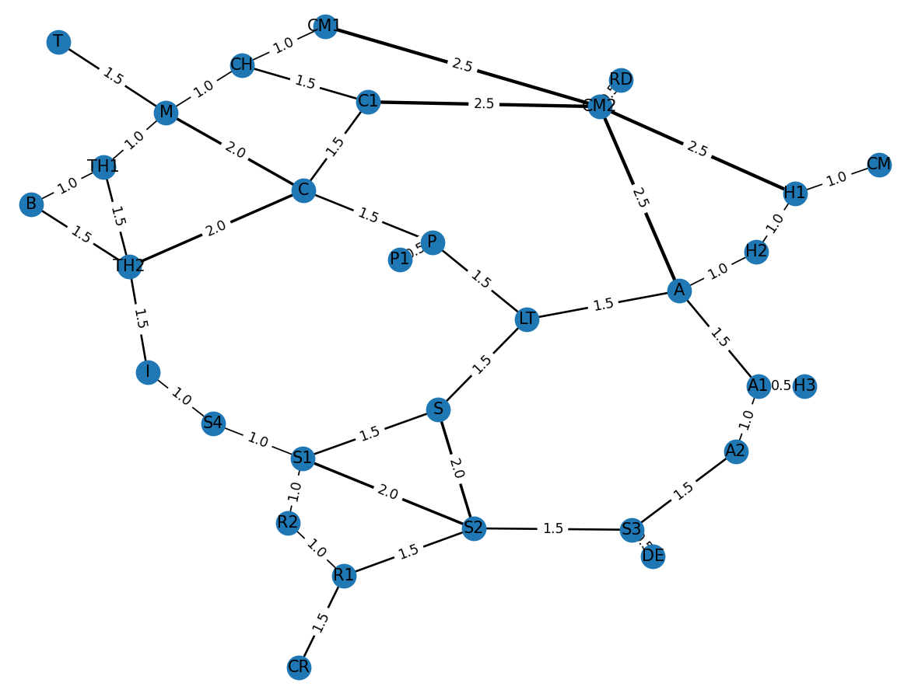
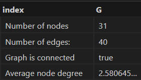
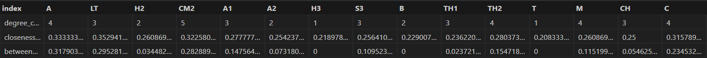
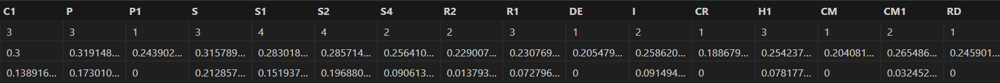
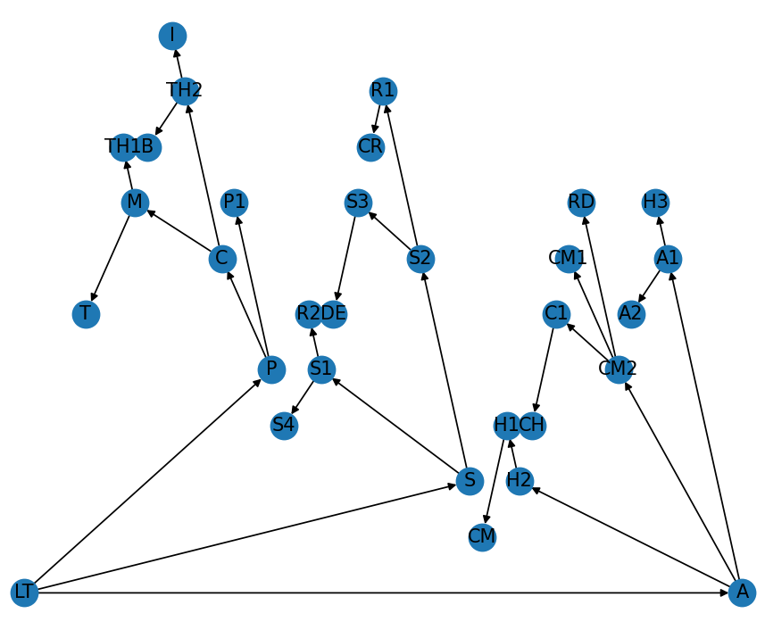
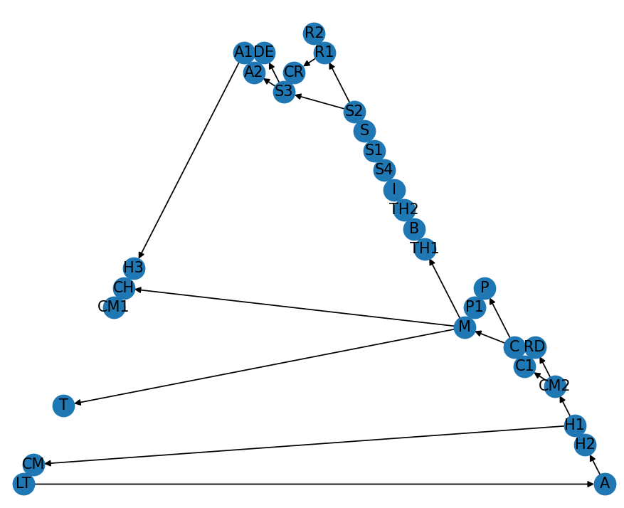

# goit-algo-hw-05

## Results:

### Task 1

Let's build a graph using the `networx` library:

The graph is undirected (to allow for the use of **DFS** and **Dijkstra** algorithms in tasks 2 and 3); the details of the graph can be found below:

As well as details on per-node basis:

### Task 2:

When analyzing the results of the **BFS** and the **DFS** algorithms applied to the original graph (`LT` set as the source node), the differences are quite striking.

As for **BFSearch**, when compared to the original graph, it can be seen that it checks the innermost (1st degree neighbors) nodes first (`A`, `P`, and `S`), then the innermost nodes of those (2nd degree neighbors), and so on. The resulting tree allows to find the shortest path to a certain node 

Turning to **DFSearch**, when compared to the **original** graph and the **BFS** tree above, it can be seen that it aims to reach the _leaf_ nodes in the first place (e.g. `A` -> `H2` -> `H1` -> `CM`, after which it goes back to `H1` and proceeds to `CM2`, and then its leaf node - `C1`). Using this method, we can make sure all the leaf nodes can be visited (graph coverage completeness), detect loops, or check the shortest path to leaf nodes.

### Task 3

List of leaf nodes: [`'H3', 'T', 'P1', 'DE', 'CR', 'CM', 'RD'`]

- Shortest path from H3 to T: [`'H3', 'A1', 'A', 'LT', 'P', 'C', 'M', 'T'`]
- Shortest path from T to P1: [`'T', 'M', 'C', 'P', 'P1'`]
- Shortest path from P1 to DE: [`'P1', 'P', 'LT', 'S', 'S2', 'S3', 'DE'`]
- Shortest path from DE to CR: [`'DE', 'S3', 'S2', 'R1', 'CR'`]
- Shortest path from CR to CM: [`'CR', 'R1', 'S2', 'S', 'LT', 'A', 'H2', 'H1', 'CM'`]
- Shortest path from CM to RD: [`'CM', 'H1', 'CM2', 'RD'`]